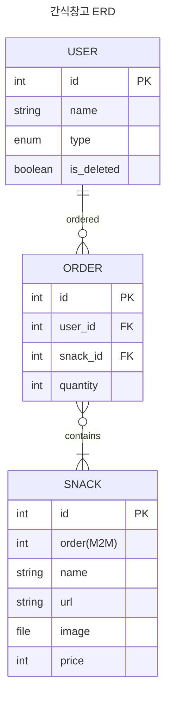

# Snack Server

데이터메이커 구성원이 사용하는 간식 주문 App 을 위한 Backend API Server

# Installation

아래의 과정을 통해 로컬 환경을 세팅합니다.

## .env

`.env.docker-compose.template` 파일을 복사해 `.env.docker-compose` 파일을 생성한 후 아래 내용을 작성합니다.

```
DB_VERSION=16.1
DB_DATABASE_NAME=snack
DB_USERNAME=snack
DB_PASSWORD=
DB_DIR=
```

- DB_DIR: postgres 컨테이너를 사용 시 컨테이너를 삭제하면 DB 내용이 삭제됩니다. 이에 local volume 과 연결하여 데이터 파일을 별도 저장하면 컨테이너가 삭제 되더라도 데이터를 유지할 수 있습니다.

## Docker Compose

개발환경은 Docker 및 Docker Compose 를 이용해 구성했습니다. 아래의 과정을 통해 이미지를 빌드하고 Docker container 를 실행합니다. 자세한 내용은 Makefile 을 살펴보면 조회할 수 있습니다.

### 빌드 및 실행

최초 실행 혹은 requirements 에 패키지가 추가된 경우 재빌드 합니다.

```
> make build
> make logs
```

### 단순 실행

보통의 경우 컨테이너를 단순 실행하여 개발서버를 구동합니다.

```
> make up
> make logs
```

### 컨테이너 재실행

컨테이너 재실행이 필요한 경우 아래와 같이 수행합니다. 전체 컨테이너 재실행이 필요한 경우 아래와 같습니다.

```
> make down
> make up
```

특정 컨테이너만 재실행 할 경우 아래와 같습니다.

```
> make restart CONTAINER=snack-server
```

# Stack

## Backend

- Python==3.11.7
- Django==4.2.9

## Frontend

- Vue3

# Spec

## APIs

### requirements

- DRF 를 사용해 RESTAPI 를 제공한다.
- drf-spectacular 를 이용해 OpenAPI format 과 SwaggerUI 로 API 문서를 제공한다.

## Authentication

### requirements

- 회원가입할 때 이메일(아이디), 비밀번호, 이름만 받습니다 .
- 회원은 일반 회원과 관리자로 나뉩니다.
- 관리자가 회원을 관리하는 목록이 존재하고, 회원을 관리자로 변경이 가능합니다.
- 회원 탈퇴가 가능하고, 가입할 때 탈퇴한 회원의 이메일로는 가입할 수 없습니다.

## Order App

### requirements

- 이름, 이미지, 구매 URL, 설명을 입력할 수 있는 게시판을 만들어주세요.
- 목록만봐도입력한모든것과상태를확인할수있으면좋겠습니다.
- 관리자가 신청 게시판에서 주문상태를 변경할 수 있습니다.
- 주문상태를 변경할 때 몇 연월에 사용될 간식인지 지정할 수 있도록 해주세요
- 주문된 간식은 월별로 볼 수 있도록 별도의 목록을 만들어주세요.

# Model



# Structure

```
.
├── snack
│   ├── core
│   └── order
└── tests
```

## core app

- 사용자 인증 관련 기능
- 서버의 필수 기능 (middleware 등)
- 유틸리티(ex: response json 처리 유틸리티 등)

## order app

- 간식 주문 관련 기능
