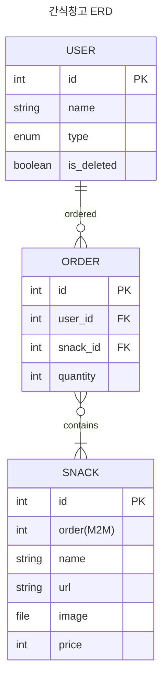

# Snack Server

데이터메이커 구성원이 사용하는 간식 주문 App 을 위한 Backend API Server

# Stack

## Backend

- Python==3.11.7
- Django==4.2.9

## Frontend

- Vue3

# Spec

## APIs

### requirements

- DRF 를 사용해 RESTAPI 를 제공한다.
- drf-spectacular 를 이용해 OpenAPI format 과 SwaggerUI 로 API 문서를 제공한다.

## Authentication

### requirements

- 회원가입할 때 이메일(아이디), 비밀번호, 이름만 받습니다 .
- 회원은 일반 회원과 관리자로 나뉩니다.
- 관리자가 회원을 관리하는 목록이 존재하고, 회원을 관리자로 변경이 가능합니다.
- 회원 탈퇴가 가능하고, 가입할 때 탈퇴한 회원의 이메일로는 가입할 수 없습니다.

## Order App

### requirements

- 이름, 이미지, 구매 URL, 설명을 입력할 수 있는 게시판을 만들어주세요.
- 목록만봐도입력한모든것과상태를확인할수있으면좋겠습니다.
- 관리자가 신청 게시판에서 주문상태를 변경할 수 있습니다.
- 주문상태를 변경할 때 몇 연월에 사용될 간식인지 지정할 수 있도록 해주세요
- 주문된 간식은 월별로 볼 수 있도록 별도의 목록을 만들어주세요.

# Model



# Structure

```
.
├── snack
│   ├── core
│   └── order
└── tests
```

## core app

- 사용자 인증 관련 기능
- 서버의 필수 기능 (middleware 등)
- 유틸리티(ex: response json 처리 유틸리티 등)

## order app

- 간식 주문 관련 기능
